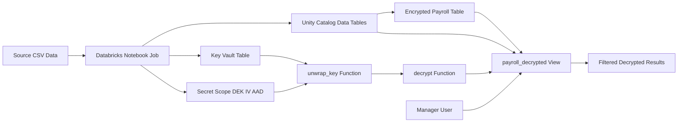

# Data-Security-Framework-On-Databricks Architecture

## Document Control
- Title: Data-Security-Framework-On-Databricks Architecture
- Project: Data-Security-Framework-On-Databricks
- Repository: Databricks-Data-Governance-Framework
- Date: 2026-03-30
- Status: Draft

## 1. Purpose
This document describes the target architecture for protecting sensitive payroll data in Databricks using envelope encryption, Unity Catalog permissions, Databricks secret scopes, and user-context filtering.

## 1.1 How to Use This Project
Use this quick start if you are onboarding from documentation instead of opening the notebook first.

Start points:
- Architecture and controls: this document
- Implementation walkthrough notebook: code/python/pii_data_process.py
- Job definition: resources/pii_data_process_job.yml

Recommended sequence:
1. Validate the bundle:

```bash
databricks bundle validate --target dev \
  --var="cluster_id=<cluster-id>" \
  --var="data_catalog=<data-catalog>" \
  --var="key_catalog=<key-catalog>" \
  --var="keyvault_user=<principal>"
```

2. Deploy the bundle:

```bash
databricks bundle deploy --target dev \
  --var="cluster_id=<cluster-id>" \
  --var="data_catalog=<data-catalog>" \
  --var="key_catalog=<key-catalog>" \
  --var="keyvault_user=<principal>"
```

3. Run the demo job:

```bash
databricks bundle run pii_data_process_job.yml --target dev \
  --var="cluster_id=<cluster-id>" \
  --var="data_catalog=<data-catalog>" \
  --var="key_catalog=<key-catalog>" \
  --var="keyvault_user=<principal>"
```

4. Open the notebook and review Steps 0 through 8 for the detailed implementation flow.

## 2. Problem Statement
The solution must allow authorized managers to view sensitive employee salary data while protecting confidentiality for all other users.

Primary requirements:
- Encrypt sensitive columns at rest in Delta tables.
- Decrypt only for authorized users at query time.
- Enforce row-level access using manager hierarchy and current user identity.
- Minimize manual operations and support repeatable deployment.
- Align with least-privilege and secure key-handling practices.

## 3. Scope
In scope:
- Bundle deployment model.
- Runtime notebook flow for key generation, encryption, and decryption.
- Unity Catalog objects for data and cryptographic controls.
- Secret scope ACL model.

Out of scope:
- Enterprise key management system integrations beyond the demonstrated key-vault table pattern.
- Network perimeter controls such as private endpoints and VPC design.
- SIEM integration and advanced monitoring stack implementation.

## 4. Architecture Overview
The implementation uses two distinct domains:
- Data domain: payroll and employee mapping objects.
- Crypto domain: key storage and cryptographic functions.

Sensitive data is stored encrypted in a base table. A controlled view applies decryption and row filters based on current user identity.



## 5. Logical Components
### 5.1 Databricks Asset Bundle
- Bundle definition: databricks.yml
- Job resource: resources/pii_data_process_job.yml
- Notebook: code/python/pii_data_process.py

### 5.2 Data Objects (Unity Catalog)
- employee_hierarchy
- employee_upn
- payroll_encrypted
- payroll_decrypted (view)

### 5.3 Crypto Objects (Unity Catalog)
- key_vault table (KEK metadata and key material)
- unwrap_key function
- encrypt function
- decrypt function

### 5.4 Secrets
- Secret scope stores encrypted DEK material:
  - dek
  - iv
  - aad

### 5.5 Identity and Access
- current_user() is used to filter decrypted output to authorized manager rows.
- Secret scope ACL grants read only to approved principals.

## 6. End-to-End Flow
1. Job starts and reads runtime parameters from widgets.
2. Catalog, schema, and volume are created if absent.
3. CSV sample data is staged and loaded into UC tables.
4. KEK is generated and stored in key_vault.
5. DEK, IV, and AAD are generated, encrypted by KEK, and stored in secret scope.
6. unwrap_key, encrypt, and decrypt functions are created.
7. Payroll salary is encrypted into payroll_encrypted.
8. View payroll_decrypted joins hierarchy mapping and decrypts only for current authorized user.

## 7. Security Controls
### 7.1 Encryption Strategy
- Envelope encryption pattern:
  - KEK secures DEK-related material.
  - DEK encrypts sensitive payload values.
- Data remains encrypted in persistent storage.

### 7.2 Access Control Strategy
- Least privilege in Unity Catalog permissions for catalogs, schemas, tables, views, and functions.
- Restrict execute permissions on decrypt-related functions.
- Restrict view access to manager-authorized groups.

### 7.3 Secret Management
- Secret values are stored in Databricks secret scope.
- Read ACL is limited to approved principals.
- Application logic retrieves secrets at runtime.

### 7.4 User Context Filtering
- current_user() enforces dynamic row-level visibility by manager identity.
- Users can only read rows mapped to their hierarchy scope.

## 8. Deployment Architecture
Deployment is controlled by Databricks Asset Bundle targets:
- dev: user-specific schema naming convention.
- prod: stable shared schema naming.

Runtime variables provide environment-specific values such as:
- cluster_id
- data_catalog
- key_catalog
- keyvault_user
- secret_scope

## 9. Operational Model
### 9.1 Validation
Use bundle validation before deployment:

```bash
databricks bundle validate --target dev \
  --var="cluster_id=<cluster-id>" \
  --var="data_catalog=<data-catalog>" \
  --var="key_catalog=<key-catalog>" \
  --var="keyvault_user=<principal>"
```

### 9.2 Deployment

```bash
databricks bundle deploy --target dev \
  --var="cluster_id=<cluster-id>" \
  --var="data_catalog=<data-catalog>" \
  --var="key_catalog=<key-catalog>" \
  --var="keyvault_user=<principal>"
```

### 9.3 Execution

```bash
databricks bundle run pii_data_process_job.yml --target dev \
  --var="cluster_id=<cluster-id>" \
  --var="data_catalog=<data-catalog>" \
  --var="key_catalog=<key-catalog>" \
  --var="keyvault_user=<principal>"
```

## 10. Risks and Mitigations
- Risk: Broad secret-scope ACL grants.
  - Mitigation: Restrict to least privilege and audit ACL changes.
- Risk: Key material exposure in logs or notebooks.
  - Mitigation: Never print secret values or raw key material.
- Risk: Function misuse to decrypt outside intended path.
  - Mitigation: Restrict execute permissions and enforce view-based access.
- Risk: Schema drift across environments.
  - Mitigation: Use bundle variables and target-specific conventions.

## 11. References
- Databricks secret management: https://docs.databricks.com/en/security/secrets/index.html
- Envelope encryption with Unity Catalog: https://medium.com/databricks-platform-sme/envelope-encryption-with-unity-catalog-b5329666d0b6

