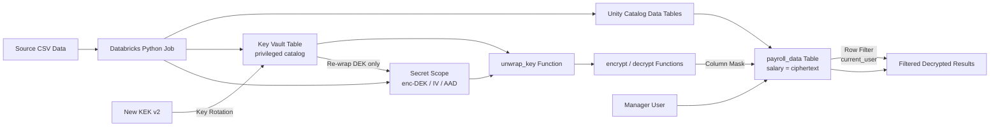

# Data-Security-Framework-On-Databricks Architecture

## Document Control

- Title: Data-Security-Framework-On-Databricks Architecture
- Project: Data-Security-Framework-On-Databricks
- Repository: Databricks-Data-Governance-Framework
- Date: 2026-03-30
- Status: Draft

## 1. Purpose

This document describes the target architecture for protecting sensitive payroll data in Databricks using envelope encryption, Unity Catalog permissions, Databricks secret scopes, and user-context filtering.

## 1.1 How to Use This Project

Use this quick start if you are onboarding from documentation instead of opening the scripts first.

Start points:

- Architecture and controls: this document
- Specific encrypting demo script: `code/python/specific_encrypting_demo.py`
- Specific encrypting demo job: `resources/specific_encrypting_demo_job.yml`
- General encrypting demo script: `code/python/general_encrypting_demo.py`
- General encrypting demo job: `resources/general_encrypting_demo_job.yml`

Recommended sequence:

1. Validate the bundle:

```bash
databricks bundle validate --target dev \
  --var="cluster_id=<cluster-id>" \
  --var="data_catalog=<data-catalog>" \
  --var="key_catalog=<key-catalog>" \
  --var="keyvault_user=<principal>"
```

1. Deploy the bundle:

```bash
databricks bundle deploy --target dev \
  --var="cluster_id=<cluster-id>" \
  --var="data_catalog=<data-catalog>" \
  --var="key_catalog=<key-catalog>" \
  --var="keyvault_user=<principal>"
```

1. Run the specific encrypting demo job:

```bash
databricks bundle run specific_encrypting_demo_job --target dev \
  --var="cluster_id=<cluster-id>" \
  --var="data_catalog=<data-catalog>" \
  --var="key_catalog=<key-catalog>" \
  --var="keyvault_user=<principal>"
```

   Or run the general encrypting demo job:

```bash
databricks bundle run general_encrypting_demo_job --target dev \
  --var="cluster_id=<cluster-id>" \
  --var="data_catalog=<data-catalog>" \
  --var="key_catalog=<key-catalog>" \
  --var="keyvault_user=<principal>"
```

1. Review `code/python/specific_encrypting_demo.py` (Steps 0-8) or `code/python/general_encrypting_demo.py` (all five building blocks) for the detailed implementation flow.

## 2. Problem Statement

The solution must allow authorized managers to view sensitive employee salary data while protecting confidentiality for all other users.

Primary requirements:

- Encrypt sensitive columns at rest in Delta tables.
- Decrypt only for authorized users at query time.
- Enforce row-level access using manager hierarchy and current user identity.
- Minimize manual operations and support repeatable deployment.
- Align with least-privilege and secure key-handling practices.

## 3. Scope

In scope:

- Bundle deployment model.
- Python script flow for key generation, encryption, and decryption.
- Unity Catalog objects for data and cryptographic controls.
- Secret scope ACL model.
- GitHub Actions CI/CD pipeline for automated validation and deployment.

Out of scope:

- Enterprise key management system integrations beyond the demonstrated key-vault table pattern.
- Network perimeter controls such as private endpoints and VPC design.
- SIEM integration and advanced monitoring stack implementation.

## 4. Architecture Overview

The implementation uses two distinct domains:

- Data domain: payroll and employee mapping objects.
- Crypto domain: key storage and cryptographic functions.

Sensitive data is stored encrypted in persistent tables. Authorized users access decrypted values transparently via AES crypto functions that run with definer's rights — either through a column mask applied directly to the table (`general_encrypting_demo.py`) or through a manager-filtered decrypted view (`specific_encrypting_demo.py`).



## 5. Logical Components

### 5.1 Databricks Asset Bundle

- Bundle definition: `databricks.yml`
- Specific encrypting demo job: `resources/specific_encrypting_demo_job.yml`
- Specific encrypting demo script: `code/python/specific_encrypting_demo.py`
- General encrypting demo job: `resources/general_encrypting_demo_job.yml`
- General encrypting demo script: `code/python/general_encrypting_demo.py`
- Sample data: `code/sample_data/` (staged to a Unity Catalog volume at runtime)
- CI/CD workflow: `.github/workflows/databricks-bundle.yml`

### 5.2 Data Objects (Unity Catalog)

- `employee_hierarchy` — source employee and salary data
- `employee_upn` — employee-to-manager mapping
- `payroll_data` — (`general_encrypting_demo.py`) salary as AES-GCM ciphertext; column mask and row filter applied directly to this table
- `payroll_encrypted` — (`specific_encrypting_demo.py`) encrypted payroll table
- `payroll_decrypted` — (`specific_encrypting_demo.py`) manager-filtered decrypted view

### 5.3 Crypto Objects (Unity Catalog — privileged catalog/schema)

- `key_vault` table — KEK metadata and key material; inaccessible to regular users
- `unwrap_key` function — decrypts DEK material using the active KEK
- `encrypt` function — wraps salary values with DEK obtained via `unwrap_key`
- `decrypt` function — registered as a column mask; runs with definer's rights

### 5.4 Secrets

- Secret scope stores encrypted DEK material:
  - `dek` — encrypted data encryption key
  - `iv` — encrypted initialisation vector
  - `aad` — encrypted additional authenticated data

### 5.5 Identity and Access

- Privileged key catalog/schema: Unity Catalog GRANT model restricts `SELECT` on `key_vault` to admins only.
- Column mask (`decrypt`): applied to `payroll_data.salary`; runs with definer's rights — users decrypt transparently without privilege on `key_vault`.
- Row filter (`payroll_manager_filter`): applied to `payroll_data`; uses `current_user()` as the invoker's identity so each manager sees only their own employees.
- Secret scope ACL grants `READ` only to the configured `keyvault_user` principal.

## 6. End-to-End Flow

### 6.1 Specific Encrypting Demo (`specific_encrypting_demo.py`)

1. Runtime parameters parsed from CLI arguments.
2. Catalog, schema, and volume created if absent; CSVs staged.
3. `employee_hierarchy` and `employee_upn` tables loaded.
4. KEK generated and inserted into `key_vault` (privileged catalog).
5. DEK, IV, and AAD generated, encrypted with KEK, stored in secret scope.
6. `unwrap_key`, `encrypt`, and `decrypt` functions created.
7. Salary encrypted into `payroll_encrypted` table.
8. `payroll_decrypted` view joins hierarchy, decrypts salary, filters by `current_user()`.

### 6.2 General Encrypting Demo (`general_encrypting_demo.py`)

1. Runtime parameters parsed from CLI arguments.
2. Catalog, schema, and volume created if absent; CSVs staged.
3. `employee_hierarchy` and `employee_upn` tables loaded.
4. KEK generated; inserted as version 1 into `key_vault` (privileged catalog).
5. DEK, IV, and AAD generated, encrypted with KEK, stored in secret scope; `READ` ACL set.
6. `unwrap_key`, `encrypt`, and `decrypt` functions created in privileged schema.
7. `payroll_data` table created with salary stored as ciphertext.
8. Column mask (`decrypt`) and row filter (`payroll_manager_filter`) applied directly to `payroll_data`; no separate view needed.
9. Key rotation: new KEK v2 generated — DEK re-wrapped under new KEK — secrets updated — KEK v1 disabled in `key_vault` — `payroll_data` unchanged.

## 7. Security Controls

### 7.1 Encryption Strategy

- Envelope encryption pattern:
  - KEK secures DEK-related material (AES-256 GCM).
  - DEK encrypts sensitive payload values (AES-256 GCM).
- Data remains encrypted in persistent storage.
- Key rotation replaces only the KEK wrapper; the underlying data ciphertext is never rewritten.

### 7.2 Access Control Strategy

- Least privilege in Unity Catalog permissions for catalogs, schemas, tables, and functions.
- `key_vault` table is accessible only to privileged admins; regular users cannot query it.
- `decrypt` function registered as a column mask with definer's rights — users obtain decrypted values without direct access to `key_vault` or the KEK.
- Row filter (`payroll_manager_filter`) uses `current_user()` in invoker context; each manager sees only their own employees.
- `EXECUTE` on `encrypt`/`decrypt`/`unwrap_key` restricted to the key admin role.

### 7.3 Secret Management

- Secret values are stored in Databricks secret scope.
- Read ACL is limited to approved principals.
- Application logic retrieves secrets at runtime.

### 7.4 User Context Filtering

- `current_user()` enforces dynamic row-level visibility by manager identity.
- Users can only read rows mapped to their hierarchy scope.

## 8. Deployment Architecture

Deployment is controlled by Databricks Asset Bundle targets:

- `dev`: user-specific schema naming convention.
- `prod`: stable shared schema naming.

Runtime variables provide environment-specific values:

- `cluster_id`
- `data_catalog`
- `key_catalog`
- `keyvault_user`
- `secret_scope`

Automated deployment is handled by the GitHub Actions workflow at `.github/workflows/databricks-bundle.yml`:

- **Pull request to `main`** (dev): `bundle validate`
- **Push or `workflow_dispatch` to `main`** (prod): `bundle validate` then `bundle deploy` then `bundle run`

Workspace credentials and variable values are injected via GitHub Actions variables (`vars.*`) and secrets (`secrets.*`) configured per environment.

## 9. Operational Model

### 9.0 CI/CD (automated)

The GitHub Actions workflow automates the full lifecycle:

- Pull requests trigger `bundle validate` against `dev` to catch configuration errors before merge.
- Merges to `main` trigger `bundle validate`, `bundle deploy`, and `bundle run` against `prod`.
- All required variables and credentials are stored as GitHub Actions repository variables and secrets.

### 9.1 Validation

Use bundle validation before manual deployment:

```bash
databricks bundle validate --target dev \
  --var="cluster_id=<cluster-id>" \
  --var="data_catalog=<data-catalog>" \
  --var="key_catalog=<key-catalog>" \
  --var="keyvault_user=<principal>"
```

### 9.2 Deployment

```bash
databricks bundle deploy --target dev \
  --var="cluster_id=<cluster-id>" \
  --var="data_catalog=<data-catalog>" \
  --var="key_catalog=<key-catalog>" \
  --var="keyvault_user=<principal>"
```

### 9.3 Execution

Specific encrypting demo:

```bash
databricks bundle run specific_encrypting_demo_job --target dev \
  --var="cluster_id=<cluster-id>" \
  --var="data_catalog=<data-catalog>" \
  --var="key_catalog=<key-catalog>" \
  --var="keyvault_user=<principal>"
```

Envelope encryption demo:

```bash
databricks bundle run general_encrypting_demo_job --target dev \
  --var="cluster_id=<cluster-id>" \
  --var="data_catalog=<data-catalog>" \
  --var="key_catalog=<key-catalog>" \
  --var="keyvault_user=<principal>"
```

## 10. Risks and Mitigations

- Risk: Broad secret-scope ACL grants.
  - Mitigation: Restrict to least privilege and audit ACL changes.
- Risk: Key material exposure in logs or notebooks.
  - Mitigation: Never print secret values or raw key material.
- Risk: Function misuse to decrypt outside intended path.
  - Mitigation: Restrict execute permissions and enforce column-mask-based access.
- Risk: Schema drift across environments.
  - Mitigation: Use bundle variables and target-specific conventions.
